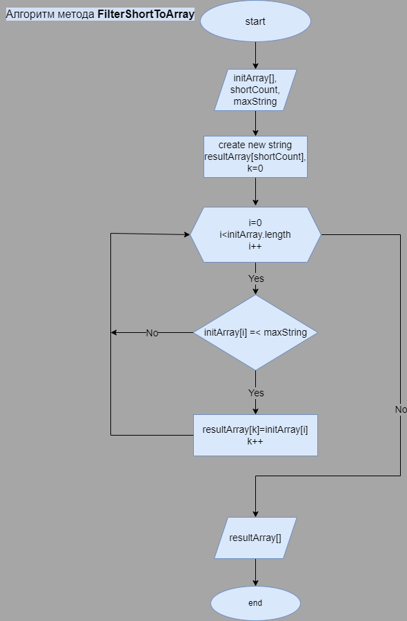
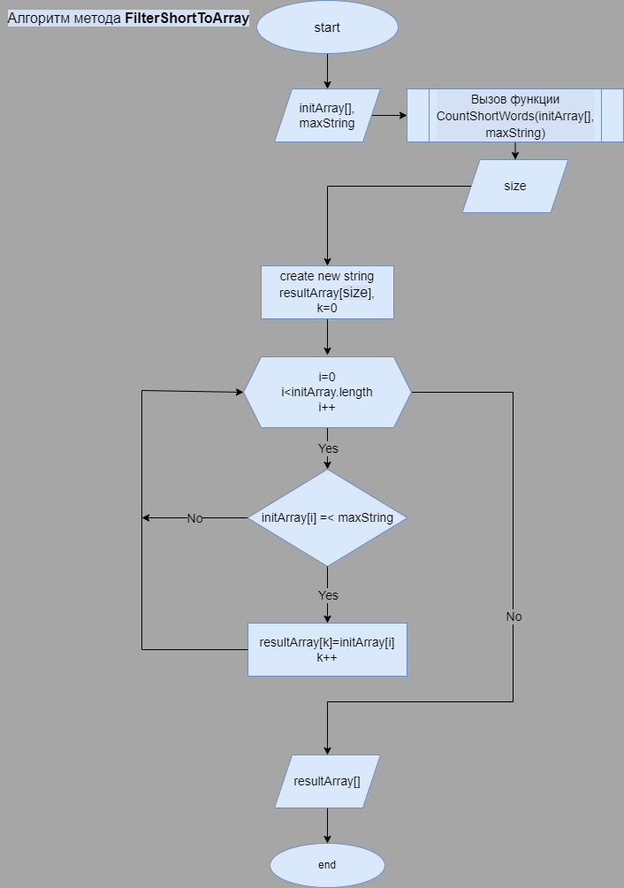

# Контрольная работа, четверть I

## Текст задачи
*Написать программу, которая из имеющегося массива строк формирует массив из строк, длина которых меньше либо равна 3 символа.Первоначальный массив можно ввести с клавиатуры, либо задать на старте выполнения алгоритма. При решении не рекомендуется пользоваться коллекциями,лучше обойтись исключительно массивами.*

**Примеры:**

    ["hello","2","world",":-)"] ->["2",":-)"]
    ["1234","1567","-2","computer science"] ->["-2"]
    ["Russia","Denmark","Kazan"] ->[]

## Декомпозиция задачи
Условимся, что первоначальные данные будем вводить с клавиатуры.    
*Перечислим блоки/методы которые нам могут понадобиться:*
1. Получение первоначальных строковых значений с консольного ввода
2. Создание массива строк из полученных значений
3. Подсчет количества элементов с длиной меньше 4 символов для выяснения размера конечного массива.
4. Создание конечного массива и запись всех элементов длиной меньше 4 символов . 
5. Вывод массива в консоль для проверки

## Выявление главного алгоритма.
* Блоки 1 и 2 отвечают за ввод данных, и могут быть не нужны, если в программу уже будут подавать готовый массив данных.
* Блок 3 - служебный, и нужен только чтобы мы могли правильно создать конечный массив. В принципе, этот подсчет можно добавить в другие методы с циклом по входному массиву данных, для оптимизации. Но в данной контрольной работе нужно показать декомпозицию, поэтому поставим его отдельно.
* блок печати 5 тоже служебный, и может изменяться в зависимости от требований к оформлению вывода. 
* Единственный блок из перечисленных, без которого не обойтись для решения задачи - это блок 4. Нарисуем для него блок-схему, как для главного алгоритма.

## Улучшение кода.

* Для избавления от "магических чисел"(числа "3" из условия задачи), зададим значение по умолчанию переменной ***maxString*** методу **CountShortWords**, указывающую на нужную длину элементов в конечном массиве. Достаточно будет задать её самостоятельно = 3 перед вызовом функций.
* Чтобы уменьшить количество входных аргументов для основного метода, сделаем вызов функции подсчета общего числа коротких строк внутри метода.   
Отразим это на блок-схеме:

* Раз мы сосредоточились на отдельных универсальных(более-менее) методах, попробуем функцию авто-документации C#, как нам показали на лекции по "правильному коду".

